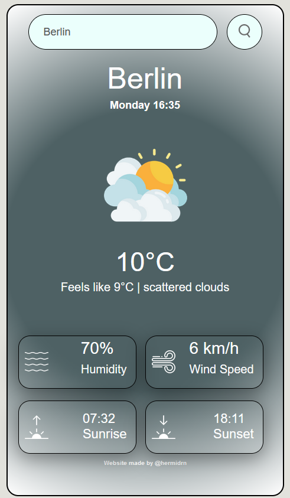
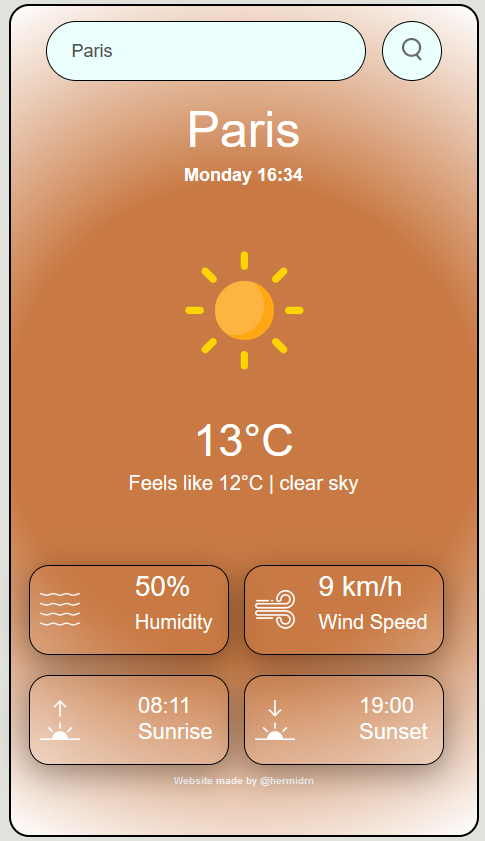
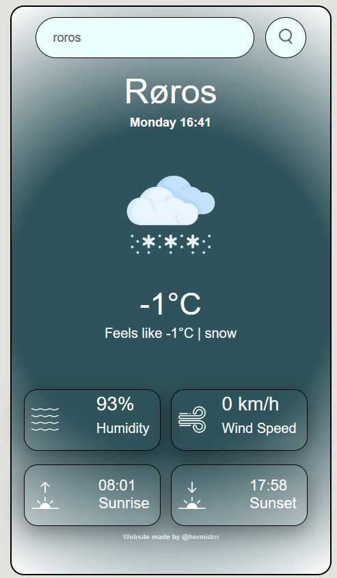
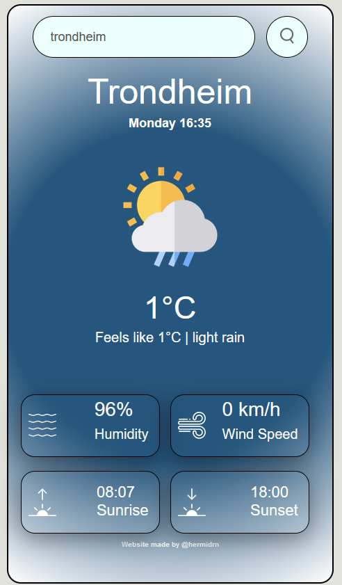
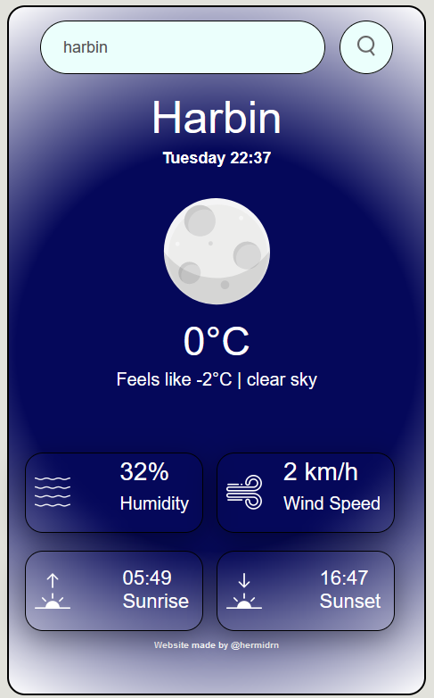

# Weather App

A simple website I made using Javascript, HTML and CSS.

The base of the app was made with the following tutorial: GreatStack - How to make a Weather App using Javascript Step by Step. The data are fetched with the Open Weather Map API.

I made a lot of modifications to display different weather datas and to the UI.

# Examples

